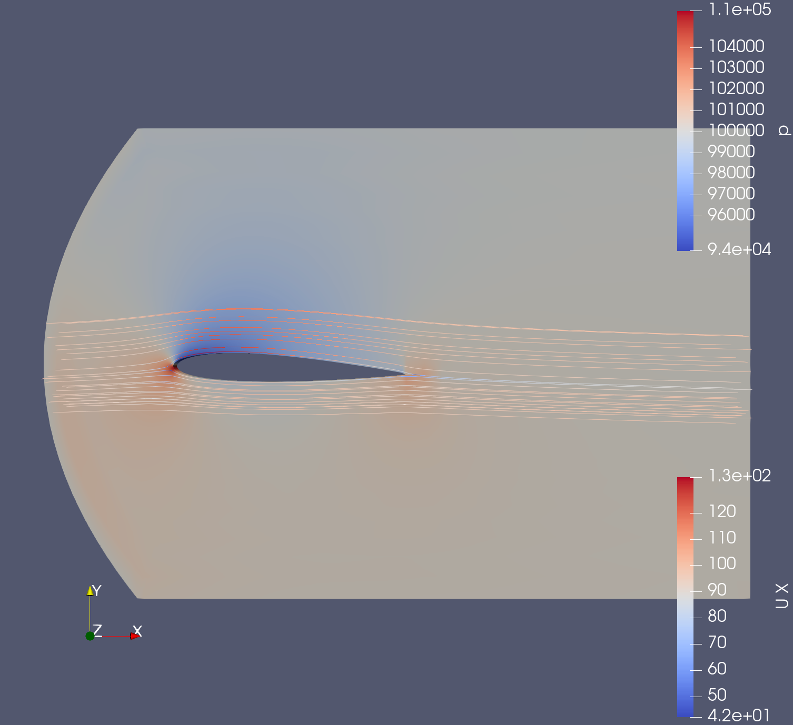
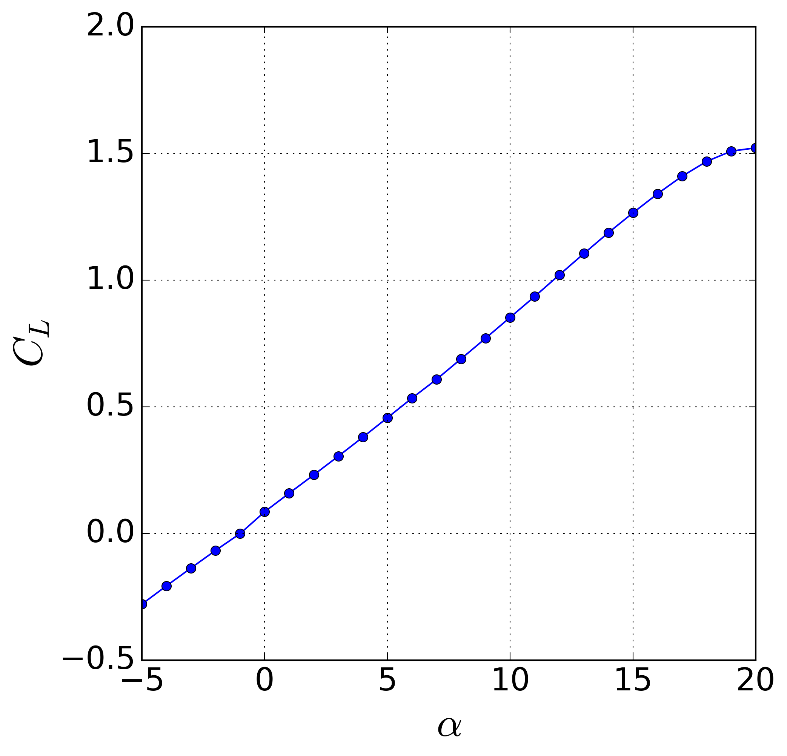

# naca-rans-aoa-sweep

Mini-étude **OpenFOAM v2412** : profil **NACA 0012**  
- c = 1,0 m (corde)  
- m = 0,02 (cambrure max)  
- p = 0,4 (position de cambrure)  
- t = 0,12 (épaisseur relative)  

Vitesse à l’entrée : **100 m/s (Ma ≈ 0,3)**  
Angles d’attaque : **– 5 ° → 20 °**  
Modèle RANS k–ω.

`alpha-naca.geo` – géométrie du profil NACA  
`batchMeshing.sh` – génération du maillage  
`runSweep.sh` – balayage des angles d’attaque  
`plot_polar.py` – tracé de la courbe portance/traînée  

## Résultats

| Visualisation Paraview                      | Courbe CL en fonction de α           |
|:-------------------------------------------:|:------------------------------------:|
|      |  |
